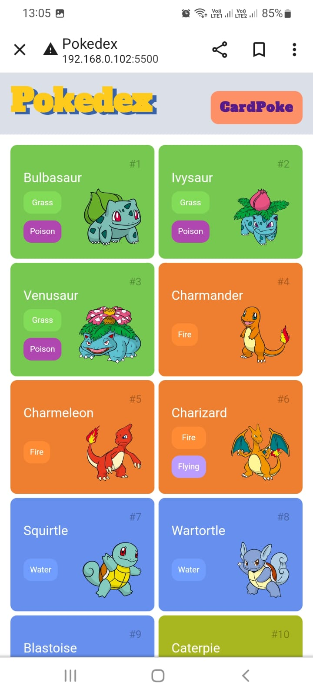

# Pokedex e PokeCard.

 * A Pokedex e um projeto do Bootcamp Orange Tech da dio.

* Utilizamos a Api da PokéAPI.co para fazer a listagem dos pokemons com os detalhes, imagem, cor, tipo, nome e numeo de cada Pokémon.

## Minha Implementação

 * A minha implementação foi uma pagina, a PokeCard.
 
 
 * A PokeCard tem um campo de pesquisa que ao digitar o numero do pokemon ele e exibido na tela com sua imagem, cor, tipo e habilidades.
 
## Projeto Responsivo

 * E esse projeto e responsivo, se adapta a dispositivos menores e maiores.

## Mobile:
 
 

## Desktop:
 
 
 